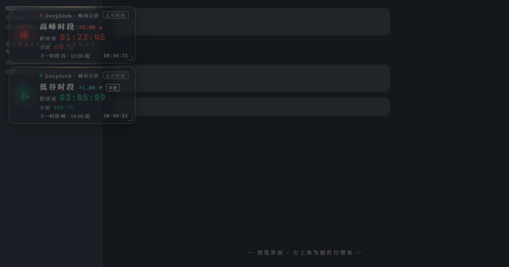
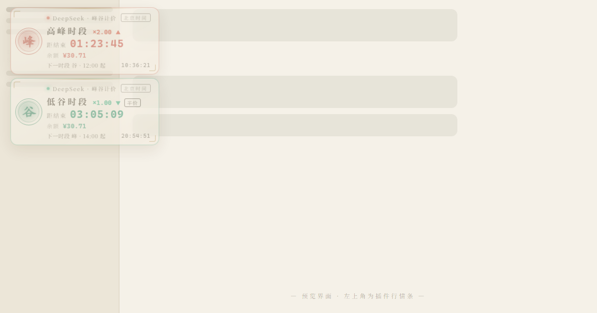

# peak-valley-ticker

> DeepSeek 峰谷计价行情条 —— 国风 · 股票行情条 · 北京时间实时倒计时



一个运行在 **DeepSeek Harness Web GUI** 左上角的峰谷计价行情条插件：按**北京时间**实时判断当前计价时段，用国风印章展示 **「峰」**（朱砂红，高峰）与 **「谷」**（松烟绿，低谷），像股票行情条一样倒计时 **距本时段结束还有多久**，并预告下一时段切换时刻；卡片内**常驻展示当前所用 DeepSeek API 的剩余金额**（每小时自动刷新，随时可查）。

## 界面效果

暗色主题（默认）：


亮色主题：



## 特性

- 🎨 **国风设计**：朱砂红「峰」印章 / 松烟绿「谷」印章（双环篆印）、金色云纹描边、回纹角饰，宣纸（亮色）与墨色（暗色）双主题
- 🕗 **北京时间**：按 UTC+8 计算，不受本地时区影响
- ⏳ **实时倒计时**：距本时段结束的 HH:MM:SS 每秒跳动，同时显示下一时段（峰/谷）切换时刻与当前北京时间
- 📈 **行情条风格**：闪烁行情点、价格倍率 ×2.00 ▲ / ×1.00 ▼（低谷为高峰半价，附「半价」角标）
- 💰 **API 余额**：卡片内常驻展示 DeepSeek API 剩余金额（宿主代理查询官方余额接口，API Key 只在宿主侧解析，不会进入浏览器；挂载时刷新，之后每小时自动刷新）
- ✋ **可拖动**：按住卡片任意位置拖到屏幕任意角落（自动吸附在视口内），位置保存在 localStorage，刷新后保持
- ⚙️ **可配置**：高峰时段、余额刷新间隔通过 profile 配置自定义

## 时段规则（北京时间）

默认高峰时段为 **09:00–12:00、14:00–18:00**，其余时间为低谷时段（价格约为高峰一半）。

可通过 profile 的 `cordis.patch.yml` 自定义：

```yaml
- insert:
    - id: peak-valley-ticker
      name: 'peak-valley-ticker'
      config:
        peakWindows:
          - [9, 12]
          - [14, 18]
        balance: true               # 余额行开关
        balanceRefreshMinutes: 60   # 余额自动刷新间隔（分钟）
        apiKeyEnv: DEEPSEEK_API_KEY # 宿主侧解析余额所用的凭据引用（env 名）
```

注意：patch 会**整体替换**该行的 `config`，修改时需完整重写所有键。

## 安装

```bash
# 方式一：从仓库直接安装（pnpm 支持 git 依赖）
dsh plugin --profile web add github:Leonx01/peak-valley-ticker

# 方式二：克隆后本地安装
git clone https://github.com/Leonx01/peak-valley-ticker
dsh plugin --profile web add file:D:/path/to/peak-valley-ticker
```

挂载到 profile 后重启 `dsh web`，浏览器打开 Web 界面即可在左上角看到行情条。本仓库已标记 `dsh-plugin` topic，也可通过 [DSH 插件市场](https://github.com/bradeGithub/DSH-Plugins-Marketplace) 类工具浏览安装。

## 结构

| 文件 | 说明 |
| --- | --- |
| `lib/index.js` | 宿主半部：注册 `/peak-valley-ticker/balance` 余额代理路由（凭据解析 + 官方余额接口转发，密钥不出宿主） |
| `lib/client.js` | 已构建的客户端 bundle（`window.__ModuleLoader__.load` 惰性 CJS 格式，无需构建步骤），注册 `shell.overlay` 列表槽位 |
| `package.json` | `dsh.client.platform: "web"` 声明客户端半部 |
| `docs/preview.html` | 独立预览页（模拟 DSH Web 明暗界面），用于生成 README 截图 |
| `scripts/generate-preview.js` | 从 `lib/client.js` 抽取插件 CSS 注入预览页，保证截图与发布版本一致 |

客户端仅依赖 seed 模块 `react` 与运行时提供的 `slots` 服务；样式以 `<style data-plugin>` 注入，插件卸载时由平台自动回收。

## 开发 / 重新生成截图

```bash
node scripts/generate-preview.js   # 重新注入最新 CSS 到 docs/preview.html
# 然后用无头浏览器截图：
#   msedge --headless=new --screenshot=docs/screenshot-dark.png \
#     --window-size=1180,620 "file:///.../docs/preview.html?theme=dark&state=both"
```

## License

[MIT](LICENSE) © Leonx01
